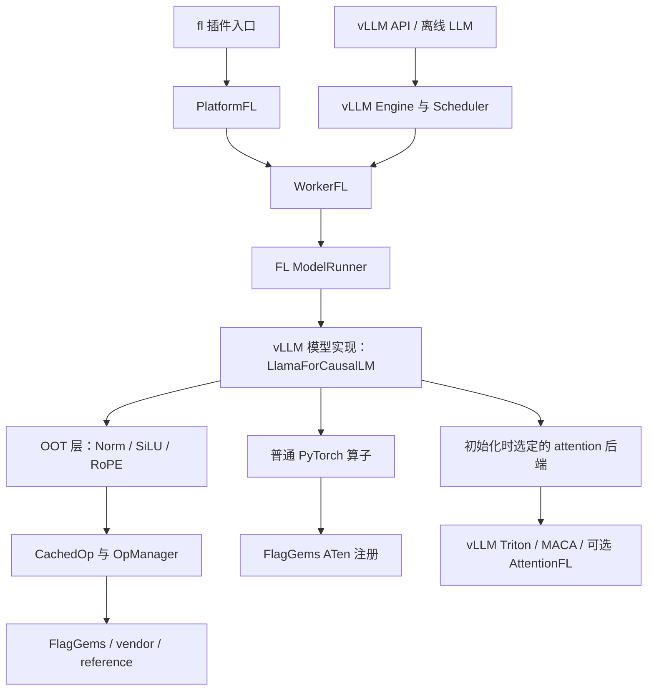

# 比赛推理框架源码分析：flagos-2026-s2

本文重点回答：框架如何执行 MiniCPM5-2B、有哪些算法、哪些能力由 vLLM 继承、哪些是 FL 的适配，以及优化时应改哪里。

分析对象固定为官方比赛分支快照 **`13eb9be69ecc5b5ca4f79c44e9ee40081eaa1bf0`**。本地个人分支 `dev-minicpm5-baseline` 在其上增加了文档，未修改实现。分析采用静态源码阅读，未做 GPU 性能或兼容性实测。本文描述版本中存在的能力，不代表这些能力都是该分支新引入，也不代表所有路径在 BI-V150 / C500 均可运行。

配套阅读：[FlagGems v5.3.5 算子分析](2026-09-20-flaggems-v5.3.5-operators.md)、[优化路线](../superpowers/plans/2026-09-20-minicpm5-optimization-roadmap.md)、[baseline 计划](../superpowers/plans/2026-09-20-minicpm5-dual-vendor-baseline.md)。

## 1. 先看结论

这套框架是 **vLLM 的多芯片平台插件，加上自有 Worker/ModelRunner、算子调度和厂商适配**。它不是一个独立重写的语言模型引擎，也没有为 MiniCPM5-2B 重新实现整套 Transformer。

对本比赛最重要的能力是：

1. 继承 vLLM 的动态批处理和分页 KV cache，并在 FL runner 中组织执行。
2. 通过 OOT 层替换，将 RMSNorm、SiLU+Mul、RoPE 接到 FlagGems 或厂商实现。
3. 通过 ATen 注册替换普通 PyTorch 算子，使 `mm` 等也可能进入 FlagGems。
4. 根据平台选择 attention 后端；其真实路径不能只看 YAML 的 `flagos` 名称。
5. 支持图捕获、批次 padding 和执行模式选择，用于减少重复启动开销。

**最容易误判的地方：天数默认选择的 FlagOS attention 路由，最终返回 vLLM `TRITON_ATTN`，并非默认调用 FlagGems `flash_attn_varlen_func`。** 沐曦默认走自注册的 MACA FlashAttention 后端。后文给出选择条件。

## 2. 入口与执行架构



`pyproject.toml` 注册两种 vLLM entry point：平台插件 `fl = vllm_fl:register`，以及通用插件 `fl = vllm_fl:register_model`。前者返回 `PlatformFL`，后者安装模型/算子兼容注册。

`PlatformFL.check_and_update_config()` 将 worker 指向 `vllm_fl.worker.worker.WorkerFL`。Worker 初始化 OOT 和 FlagGems，runner 按 scheduler 输出准备 batch、KV 地址、attention 元数据，执行模型并采样。

模型文件仍由 vLLM registry/loader 处理；已核对的 MiniCPM5-2B 配置为标准 `LlamaForCausalLM`。仓库没有 MiniCPM5 专属实现不等于无法运行。

源码依据：[插件入口](https://github.com/flagos-ai/vllm-plugin-FL/blob/13eb9be69ecc5b5ca4f79c44e9ee40081eaa1bf0/vllm_fl/__init__.py)、[PlatformFL](https://github.com/flagos-ai/vllm-plugin-FL/blob/13eb9be69ecc5b5ca4f79c44e9ee40081eaa1bf0/vllm_fl/platform.py)、[WorkerFL](https://github.com/flagos-ai/vllm-plugin-FL/blob/13eb9be69ecc5b5ca4f79c44e9ee40081eaa1bf0/vllm_fl/worker/worker.py)。

## 3. 框架包含哪些算法和机制

| 算法/机制 | 解决的问题 | 本分支中的实现归属 | 与本比赛关系 |
|---|---|---|---|
| Continuous batching | 请求完成后释放位置，新请求动态加入 | vLLM scheduler 决策，FL runner 持久 batch 执行 | 核心 |
| Chunked prefill | 长 prompt 分块，避免一次占满 token 预算 | 上游调度能力，runner 接收每请求的 scheduled tokens | 核心候选，需配置确认 |
| 分页 KV cache | 按块分配与寻址，减少连续大块分配需求 | vLLM cache 管理与 FL 后端读写 | 核心 |
| Prefix caching | 复用已计算的共同前缀 KV | 主要由上游 cache/scheduler 管理 | 取决于数据复用与规则 |
| GQA | 多个 Q heads 共享较少的 KV heads | 模型结构和 attention kernel | MiniCPM5 核心 |
| 分块 FlashAttention / Triton attention | 减少 attention 中间矩阵与访存 | 后端不同，实现不同 | 核心，但要区分真实后端 |
| Cascade attention | 公共前缀与私有后缀分开计算，再合并 | FL attention 有实现和启发式选择 | 条件性；沐曦显式禁用 |
| CUDA-like graph 捕获/重放 | 减少重复 Python/驱动启动开销 | FL GraphWrapper + vLLM dispatcher | 高价值候选，硬件支持待测 |
| Breakable graph | 在 attention/KV 边界分开图段和 eager 段 | 直接重导出 vLLM 0.24 接口 | 兼容性与执行开销候选 |
| Speculative decoding | 草稿提出多 token，目标模型验证 | runner 接入 vLLM proposer/rejection sampler | 有条件；不是默认启用 |
| MTP=1 结构化输出 mask 批处理 | 降低多请求 grammar mask 的 CPU 开销 | 自有 AsyncSchedulerFL 包装 | 普通文本 baseline 不适用 |
| TP/PP/DP、KV transfer | 模型/批次并行和跨实例缓存传输 | vLLM 接口 + FlagCX 适配 | 单卡 2B 首轮不是重点 |
| MoE / MLA / GDN / W8A8 | 其他模型结构和低精度计算 | 具有适配入口，部分受限 | 不能直接套到本模型 |

表中“包含”表示存在代码或上游接入，不能读作“自动启用”或“已经完成两卡验证”。

## 4. 动态 batch、prefill 与 decode 如何执行

`model_runner.py::execute_model()` 消费 `SchedulerOutput`，重点读取：

- `num_scheduled_tokens`：每个请求本轮执行多少 token。
- `total_num_scheduled_tokens`：本轮总 token 数。
- `num_common_prefix_blocks`：用于共同前缀优化判断。
- KV transfer 元数据、可选 speculative token 信息。

runner 依次更新持久 batch 状态、准备输入和 logits 索引、决定 graph/padding、构造 attention 元数据，再执行前向与采样。这是动态 batch 的执行侧，不是每轮把所有请求重建为一个固定 padding batch。

**连续批处理与 chunked prefill 的策略主体仍属于 vLLM scheduler。** `scheduler_fl.py` 并没有另写一套针对 MiniCPM 的请求调度算法，它主要扩展 MTP=1 的 xGrammar mask 生成。

调参含义：`max-num-seqs` 控制活跃序列上限，`max-num-batched-tokens` 控制 token 预算，二者并不等价。更大的 token 预算可能增大 prefill 工作量；更大的序列上限可能增大 decode 并行度，也可能导致 KV 压力和重算。最优值必须依据比赛输入输出分布测试。

源码依据：[FL ModelRunner 的 execute_model、_prepare_inputs、_determine_batch_execution_and_padding](https://github.com/flagos-ai/vllm-plugin-FL/blob/13eb9be69ecc5b5ca4f79c44e9ee40081eaa1bf0/vllm_fl/worker/model_runner.py)、[AsyncSchedulerFL](https://github.com/flagos-ai/vllm-plugin-FL/blob/13eb9be69ecc5b5ca4f79c44e9ee40081eaa1bf0/vllm_fl/worker/scheduler_fl.py)。

## 5. KV cache：分页寻址与显存预算

### 5.1 分页的实际含义

attention 通过 `block_table` 将逻辑序列块映射到物理块；新增 K/V 通过 `slot_mapping` 定位写入位置。AttentionFL 的缓存布局为：

```text
[2, num_blocks, block_size, num_kv_heads, head_size]
 ^
 K / V
```

这不是“每步重新计算全部 K/V”。decode 每次写入新增 token 的 K/V，随后读取已有上下文缓存。分页解决分配和地址组织，FlashAttention 解决 attention 计算/访存；两者是互补机制。

`PlatformFL` 在 block_size 未设置时，普通设备路径给出 16；后端约束或后续配置可能调整，不能把该值当作所有硬件的最终运行值。

### 5.2 GQA 对缓存容量的意义

以该模型 42 层、2 个 KV heads、head_dim=128、BF16 为前提，TP=1 下每个 token 的全层 K/V 理论原始存储为：

`42 × 2(K/V) × 2(KV heads) × 128 × 2 bytes = 43008 bytes = 42 KiB`。

8192 token 的单序列原始 KV 约 336 MiB。这不包含权重、激活、图内存、块对齐、临时缓冲和分配器开销，不能用 64 GB 直接除出可用并发数。

### 5.3 显存预算的硬件条件

`WorkerFL.determine_available_memory()` 测量权重、峰值激活和非 PyTorch 内存，再给 KV cache 分配预算。代码还有 graph 内存估算，但该调用由 `current_platform.is_cuda()` 守卫；`PlatformFL.is_cuda()` 仅对 vendor=nvidia 返回真。

因此，**不能把这段 graph 预算保护视为已经对天数/沐曦生效**。两卡需要实测图捕获前后内存，并保留足够余量；开启 graph 后直接沿用 eager 的极限显存比例可能失败。

## 6. 算子接入有两条路径

### 6.1 模型层替换：OOT → CachedOp → 后端

`ops/custom_ops.py` 注册 `SiluAndMulFL`、`GeluAndMulFL`、`RMSNormFL`、`RotaryEmbeddingFL`。以 RMSNorm 为例：

```text
vLLM RMSNorm → RMSNormFL.forward_oot
→ CachedOp("rms_norm") → FlagGemsBackend.rms_norm
→ gems_rms_forward → rms_norm 或 fused_add_rms_norm
```

`CachedOp` 默认启用快速路径：首次解析函数，以后直接调用；policy epoch 改变时失效。发生异常且非 strict 时，切回 manager 的回退路径。IO dump 开启时也经过 manager。

`OpManager` 按 per-op 顺序、后端可用性、vendor 过滤和优先级选择实现，并缓存失败实现。失败记录按 op/impl 保存，不以某个输入 shape 为边界：某次失败可能影响后续其他 shape，排障/性能实验应重启进程或明确重置状态。

### 6.2 普通 PyTorch 算子替换：ATen → FlagGems

Worker 在 `USE_FLAGGEMS` 开启时调用 `flag_gems.enable()` 或 `only_enable()`。这会替换相应 ATen dispatch 实现，因此矩阵乘、索引、归约等不必出现在 FL 的显式 OOT 表中，也可能走 FlagGems。

反之，看到 FlagGems 已安装，并不能证明模型的 linear 已进入其 `mm`：vLLM linear 路径、ATen 分解、编译融合、白名单及厂商特化都会影响实际调用。

源码依据：[OOT 注册](https://github.com/flagos-ai/vllm-plugin-FL/blob/13eb9be69ecc5b5ca4f79c44e9ee40081eaa1bf0/vllm_fl/ops/custom_ops.py)、[CachedOp](https://github.com/flagos-ai/vllm-plugin-FL/blob/13eb9be69ecc5b5ca4f79c44e9ee40081eaa1bf0/vllm_fl/dispatch/__init__.py)、[OpManager](https://github.com/flagos-ai/vllm-plugin-FL/blob/13eb9be69ecc5b5ca4f79c44e9ee40081eaa1bf0/vllm_fl/dispatch/manager.py)。

## 7. Attention 的真实选择与算法

### 7.1 两个平台的默认路线

| 条件 | 返回/注册的真实后端 | 直接改 FlagGems attention 是否一定生效 |
|---|---|---|
| 天数默认 YAML，未设置 `VLLM_FL_USE_FLAGGEMS_ATTN` | FlagGemsBackend 选择函数返回 vLLM `TRITON_ATTN` | 否 |
| 天数选择 FlagOS 路由，且 `VLLM_FL_USE_FLAGGEMS_ATTN=1` | `AttentionFLBackend` | 该路径会调用 FlagGems，仍需日志确认 |
| 沐曦默认 YAML | `vendor:metax` → 注册为 `FLASH_ATTN` 的 `MacaFlashAttentionBackend` | 否 |
| 沐曦仅设置上述环境变量，未修改路由 | 仍优先 vendor:metax | 否，变量不影响 vendor 选择函数 |

`PlatformFL.get_attn_backend_cls()` 通过 `call_op("attention_backend")` 返回类路径。其 `selected_backend` 参数没有用于选择分支，因此不能假设仅设置上游 attention backend 选项就覆盖 FL 路由；实际类路径日志才是依据。

`attention_backend` 是初始化时的选择操作，不是每个 token 都执行的 attention kernel。选择函数成功后，后续 attention 执行错误不自动回到这里重新选择另一套后端。

源码依据：[FlagGemsBackend.attention_backend](https://github.com/flagos-ai/vllm-plugin-FL/blob/13eb9be69ecc5b5ca4f79c44e9ee40081eaa1bf0/vllm_fl/dispatch/backends/flaggems/flaggems.py)、[MetaX 选择函数](https://github.com/flagos-ai/vllm-plugin-FL/blob/13eb9be69ecc5b5ca4f79c44e9ee40081eaa1bf0/vllm_fl/dispatch/backends/vendor/metax/metax.py)。

### 7.2 可选 AttentionFL 路径

实现接收变长 query 起始位置、sequence lengths 和 block table，调用 `flag_gems.flash_attn_varlen_func`。数学上是带因果 mask 的 GQA；底层分块计算 QK、在线 softmax 与 PV，避免完整物化注意力矩阵。更详细的 kernel 算法见配套算子文档。

明确限制：`fa_version=2`；调用 `num_splits=0`；拒绝量化 KV cache 和融合输出量化。不能把其他 FlashAttention 版本的功能自动归给此路径。

新增 K/V 在独立 `do_kv_cache_update()` 中写入，由 vLLM unified KV update 调用，`forward()` 不重复写。若做 RoPE+KV 写入融合，必须同时处理原有写入，避免写两次或丢失依赖。

### 7.3 沐曦路径

`MacaFlashAttentionBackend` 分开处理 prefill/decode：prefill 调厂商 `flash_attn_varlen_func`，decode 调 `flash_attn_with_kvcache`。它的缓存写入代码位于自身 forward 路径，不应照搬 AttentionFL 的生命周期假设。

prefill 分支中还出现 `prefill_seq_lens.tolist()`、新建张量和 cumsum。它们是否引入显著同步/CPU 开销需要 profile，不能仅凭代码就宣布是瓶颈。

源码依据：[AttentionFL](https://github.com/flagos-ai/vllm-plugin-FL/blob/13eb9be69ecc5b5ca4f79c44e9ee40081eaa1bf0/vllm_fl/dispatch/backends/flaggems/impl/attention.py)、[MACA attention](https://github.com/flagos-ai/vllm-plugin-FL/blob/13eb9be69ecc5b5ca4f79c44e9ee40081eaa1bf0/vllm_fl/dispatch/backends/vendor/metax/impl/attention/flash_attn.py)。

### 7.4 Cascade attention 与 prefix caching 不同

Prefix caching 复用已经计算的 KV，避免重复 prefill。Cascade attention 则把一个 batch 的公共前缀 attention 和私有后缀 attention 分开计算，再按各自 log-sum-exp 合并输出，以减少公共前缀 KV 重复读取。

本分支 AttentionFL 的启发式要求公共前缀至少 256 tokens、至少 8 个请求；ALiBi、滑窗、local attention、DCP>1 等条件会禁止该路径，还会估算 CTA waves 判断收益。代码存在不表示本比赛已命中：沐曦平台明确设置 `disable_cascade_attn=True`，随机输入也不自然具备足够公共前缀。

## 8. Graph、异步执行和推测解码

### 8.1 Graph 执行

`GraphWrapper` 以 `BatchDescriptor` 缓存图，首次捕获、后续 replay，维护输出对象与共享图内存池；调试模式核对输入地址一致。runner 判断 uniform decode、token 数、LoRA 等条件，选择执行模式和 padding。

收益来自减少 kernel 启动/调度开销，不是改变 attention 数学算法。padding 增加无效工作、更多捕获尺寸增加显存占用，因此 graph 也可能在某些场景无收益。

`break_graph.py` 直接重导出上游 breakable graph：在 attention/KV cache 边界交替执行图段和 eager 段，并非 FL 新写的编译器融合算法。删除 `--enforce-eager` 只允许使用配置中的图模式，不足以证明成功捕获。

源码依据：[GraphWrapper](https://github.com/flagos-ai/vllm-plugin-FL/blob/13eb9be69ecc5b5ca4f79c44e9ee40081eaa1bf0/vllm_fl/compilation/graph.py)、[breakable graph 适配](https://github.com/flagos-ai/vllm-plugin-FL/blob/13eb9be69ecc5b5ca4f79c44e9ee40081eaa1bf0/vllm_fl/compilation/break_graph.py)。

### 8.2 Speculative decoding 和 MTP

runner 接入 N-gram、draft model、EAGLE、DFlash、Medusa 等 proposer，以及上游 rejection sampler。算法思想是廉价提出多 token，目标模型批量验证并接受合法前缀；收益取决于接受率、验证成本和额外状态。

这些是基础设施，不说明 MiniCPM5-2B 提供兼容 draft/MTP 权重，也不说明赛事允许启用。高并发吞吐场景与单请求延迟场景的收益可能不同，不列为首轮必做。

`AsyncSchedulerFL` 特有的 xGrammar 优化针对 `num_speculative_tokens==1`；符合条件时批量填充当前/bonus token mask，临时推进 grammar 后 rollback。普通无结构化输出的 BF16 baseline 不会因此自动加速。

## 9. 其他能力与不适用项

- **FlagCX：** 提供 collective 通信和 KV transfer 接入，包括 reduce/scatter、跨实例缓存发送接收等。它是多卡/分离式部署基础设施，不是单卡默认吞吐优化。
- **MoE：** 有路由、top-k、专家对齐和 fused expert 接入。MiniCPM5-2B 是稠密模型，不执行专家路由。
- **MLA/DSA：** 存在文件和厂商路径，但 FlagGemsBackend 的 attention 选择函数对 `use_mla=True` 直接抛 NotImplementedError；不能凭目录宣布完整支持。
- **GDN/FLA：** 为其他混合或线性注意力模型适配，与本模型标准 GQA 不同。
- **W8A8：** 有量化线性层/专家实现，但不属于当前保持 BF16 精度的 baseline。

## 10. 对本比赛的直接启示

| 优先检查 | 理由 | 应采集的证据 |
|---|---|---|
| 实际 attention 类路径 | 决定优化目标属于 vLLM、MACA 还是 FlagGems | 初始化日志、profile kernel |
| `mm` 的最终函数来源与形状 | GEMM 没有通过显式 OOT 列表展示全部路径 | ATen trace、厂商覆盖、M/N/K/stride |
| graph 与 batch | 小模型可能受启动开销限制 | graph replay、padding、每步 kernel 时间 |
| Norm/激活/RoPE | 已接入且已有融合，可针对形状优化 | 函数命中、C/Python 路径、调用占比 |
| 沐曦采样 | 本分支将 top-k/top-p 过滤强制转为 PyTorch fallback | 官方采样设置、排序/过滤耗时 |

沐曦采样补丁并不等于 CPU 采样，PyTorch 操作仍可能在 GPU 上执行、也可能再被 FlagGems 接管；需要追踪实际算子。不要把模型采样的 top-k 与 MoE 的 `topk_softmax` 混为一谈。

取证时结合后端类路径、oplist、函数来源和设备 profile；仅一个“Enable all ops”日志不够。worker 在 DEBUG 下会打印环境变量，分享日志前应去除凭据，正式计时恢复正常日志级别。

源码依据：[MetaX 采样补丁](https://github.com/flagos-ai/vllm-plugin-FL/blob/13eb9be69ecc5b5ca4f79c44e9ee40081eaa1bf0/vllm_fl/dispatch/backends/vendor/metax/patches/topk_topp_sampler.py)。

## 11. 推荐源码阅读顺序

1. `pyproject.toml`、`vllm_fl/__init__.py`、`platform.py`：插件入口与平台选择。
2. `worker/worker.py`：开启 FlagGems、显存估计与模型启动。
3. `ops/custom_ops.py`、`dispatch/__init__.py`、`dispatch/manager.py`：层替换与实际 dispatch。
4. `dispatch/backends/flaggems/flaggems.py`、`vendor/metax/metax.py`：attention 选择条件。
5. 按实际后端阅读 attention 实现，再看 `model_runner.py` 的执行、padding 和 KV metadata。
6. 对照配套文档进入 FlagGems 对应 kernel，而不是先从算子目录随机选函数优化。

本报告的结论边界是“固定源码版本的实现与条件分析”。硬件兼容、运行时选中路径、精度和收益，仍需两台服务器分别验证。
